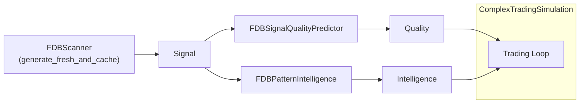
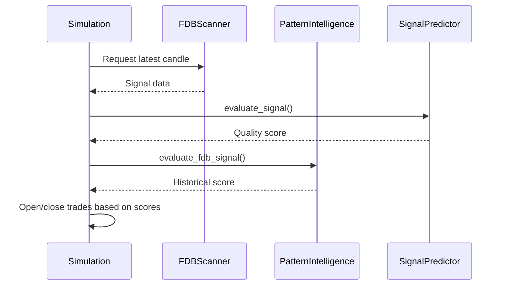

# 🚀 Complex Trading Simulation Example

This guide explains the purpose and structure of `examples/complex_trading_simulation.py`.
It demonstrates how different FDB modules work together to simulate a trading loop.

## 📦 Imports Used

The example brings in the following modules:

- `random` – random price changes
- `datetime` – tracking trade timestamps
- `List` – type hints for trade history
- `FDBSignalQualityPredictor` – scores signals using ML intelligence
- `FDBPatternIntelligence` – evaluates historical pattern performance
- `generate_fresh_and_cache` – pulls real‑time signals from `FDBScanner`

## 🗺️ Data Flow Overview

## 📈 Trading Loop Sequence

The sequence above shows how the simulation fetches data, scores it with both the predictor and pattern intelligence, and decides when to trade.

Use this example as a starting point to build more advanced bots that rely on the FDB ecosystem.
