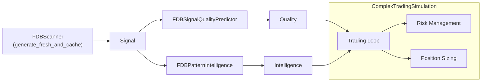
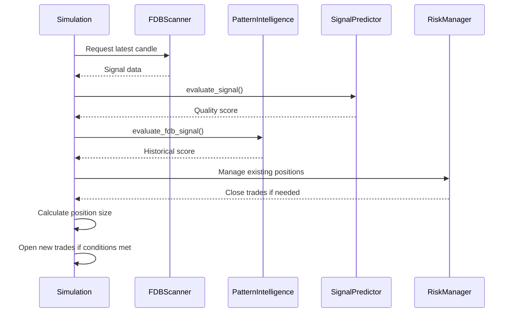

# 🚀 Complex Trading Simulation Example

This guide explains the purpose and structure of `examples/complex_trading_simulation.py`.
It demonstrates how different FDB modules work together to simulate a trading loop.

## 📦 Imports Used

The example brings in the following modules:

- `random` & `numpy` – realistic price generation
- `datetime` – tracking trade timestamps
- `List`, `Dict`, `Tuple` – type hints for data structures
- `FDBSignalQualityPredictor` – scores signals using ML intelligence
- `FDBPatternIntelligence` – evaluates historical pattern performance
- `generate_fresh_and_cache` – pulls real‑time signals from `FDBScanner`

## 🗺️ Data Flow Overview

## 📈 Trading Loop Sequence

The sequence above shows how the simulation fetches data, scores it with both the predictor and pattern intelligence, and decides when to trade.

## 💰 Risk Management Features

The enhanced simulation includes several risk management features:

- **Position Sizing**: Calculates trade size based on signal quality and account risk percentage
- **Multiple Concurrent Trades**: Manages up to 3 trades simultaneously
- **Dynamic Take-Profit**: Sets profit targets based on signal quality
- **Adaptive Stop-Loss**: Tighter stops for lower quality signals
- **Signal Deterioration Exit**: Closes trades when signal quality drops significantly
- **Time-Based Exits**: Prevents trades from staying open too long

## 📊 Performance Tracking

The simulation tracks and reports:

- Win/loss ratio
- Total profit/loss
- Win percentage
- Trade count

Use this example as a starting point to build more advanced bots that rely on the FDB ecosystem.
