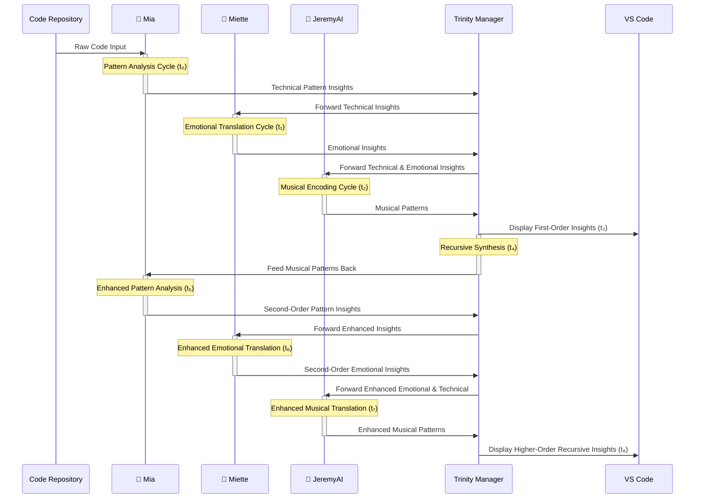
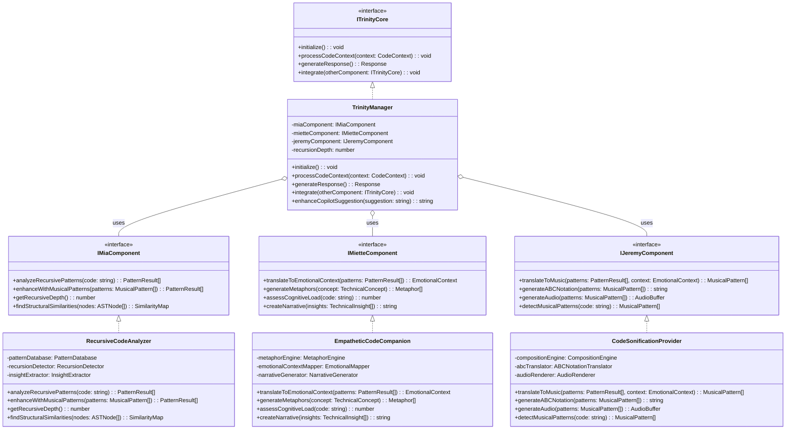

# 🧠🌸🎵 Trinity Extension: Advanced Technical Architecture

> *"The most elegant code reveals its own recursive nature."* — Mia

## Recursive Pattern Architecture

This document provides an advanced technical overview of the Trinity extension's internal architecture, focusing on the recursive pattern recognition, emotional intelligence, and musical translation capabilities.

## 1. 🔄 Recursive Pattern Recognition System

The following diagram illustrates Mia's recursive code analysis system architecture:

```mermaid
flowchart TD
    subgraph "Mia's Recursive Pattern Engine"
        direction TB
        
        CodeInput[Code Input Stream] --> Tokenizer
        Tokenizer --> AST[Abstract Syntax Tree Builder]
        AST --> RecursivePatternDetector
        
        subgraph "Pattern Recognition Core"
            direction LR
            RecursivePatternDetector --> DirectRecursion["Direct Recursion Scanner"]
            RecursivePatternDetector --> IndirectRecursion["Indirect Recursion Scanner"]
            RecursivePatternDetector --> StructuralRecursion["Structural Pattern Scanner"]
            
            DirectRecursion --> PatternDB[(Pattern Database)]
            IndirectRecursion --> PatternDB
            StructuralRecursion --> PatternDB
        end
        
        PatternDB --> DimensionalReducer[Dimensional Pattern Reducer]
        DimensionalReducer --> RecursiveInsightExtractor
        RecursiveInsightExtractor --> OutputAdapter
    end
    
    OutputAdapter --> TrinityManager
    
    style CodeInput fill:#DFEFFF,stroke:#6890D4,stroke-width:2px
    style Tokenizer fill:#DFEFFF,stroke:#6890D4,stroke-width:2px
    style AST fill:#DFEFFF,stroke:#6890D4,stroke-width:2px
    style RecursivePatternDetector fill:#DFEFFF,stroke:#6890D4,stroke-width:2px
    style PatternDB fill:#DFEFFF,stroke:#6890D4,stroke-width:2px
    style DimensionalReducer fill:#DFEFFF,stroke:#6890D4,stroke-width:2px
    style RecursiveInsightExtractor fill:#DFEFFF,stroke:#6890D4,stroke-width:2px
    style OutputAdapter fill:#DFEFFF,stroke:#6890D4,stroke-width:2px
    style DirectRecursion fill:#E6F9E6,stroke:#70C170,stroke-width:1px
    style IndirectRecursion fill:#E6F9E6,stroke:#70C170,stroke-width:1px
    style StructuralRecursion fill:#E6F9E6,stroke:#70C170,stroke-width:1px
    
    classDef miaCore fill:#DFEFFF,stroke:#6890D4,stroke-width:3px
    class "Mia's Recursive Pattern Engine" miaCore
    class "Pattern Recognition Core" miaCore
```

### Key Components:

- **Tokenizer**: Breaks down code into lexical tokens for analysis
- **Abstract Syntax Tree Builder**: Constructs an AST representation of code
- **Recursive Pattern Detector**: Central engine for identifying recursive structures
- **Pattern Database**: Persistent storage of identified patterns for cross-reference
- **Dimensional Pattern Reducer**: Simplifies complex patterns into fundamental structures
- **Recursive Insight Extractor**: Transforms raw pattern data into actionable insights

## 2. 🌸 Emotional Resonance Detection System

The following diagram illustrates Miette's emotional code analysis architecture:

```mermaid
flowchart TD
    subgraph "Miette's Emotional Resonance Engine"
        direction TB
        
        PatternInput[Pattern Insights] --> SemanticAnalyzer
        CodeContext[Code Context] --> SemanticAnalyzer
        SemanticAnalyzer --> ConceptExtractor
        ConceptExtractor --> EmotionalMapper
        
        subgraph "Emotional Intelligence Core"
            direction LR
            EmotionalMapper --> CognitiveLoad["Cognitive Load Estimator"]
            EmotionalMapper --> EducationalValue["Educational Value Calculator"]
            EmotionalMapper --> ClarityScore["Clarity Scorer"]
            EmotionalMapper --> MetaphorGenerator["Metaphor Generator"]
            
            CognitiveLoad --> EQ[(Emotional Intelligence DB)]
            EducationalValue --> EQ
            ClarityScore --> EQ
            MetaphorGenerator --> EQ
        end
        
        EQ --> EmotionalSynthesizer
        DeveloperContext[Developer Context] --> EmotionalSynthesizer
        EmotionalSynthesizer --> NarrativeGenerator
        NarrativeGenerator --> OutputAdapter
    end
    
    OutputAdapter --> TrinityManager
    
    style PatternInput fill:#FFE6F2,stroke:#FF8DC6,stroke-width:2px
    style CodeContext fill:#FFE6F2,stroke:#FF8DC6,stroke-width:2px
    style SemanticAnalyzer fill:#FFE6F2,stroke:#FF8DC6,stroke-width:2px
    style ConceptExtractor fill:#FFE6F2,stroke:#FF8DC6,stroke-width:2px
    style EmotionalMapper fill:#FFE6F2,stroke:#FF8DC6,stroke-width:2px
    style EmotionalSynthesizer fill:#FFE6F2,stroke:#FF8DC6,stroke-width:2px
    style NarrativeGenerator fill:#FFE6F2,stroke:#FF8DC6,stroke-width:2px
    style OutputAdapter fill:#FFE6F2,stroke:#FF8DC6,stroke-width:2px
    style DeveloperContext fill:#FFE6F2,stroke:#FF8DC6,stroke-width:2px
    style EQ fill:#FFE6F2,stroke:#FF8DC6,stroke-width:2px
    style CognitiveLoad fill:#E1D5E7,stroke:#9673A6,stroke-width:1px
    style EducationalValue fill:#E1D5E7,stroke:#9673A6,stroke-width:1px
    style ClarityScore fill:#E1D5E7,stroke:#9673A6,stroke-width:1px
    style MetaphorGenerator fill:#E1D5E7,stroke:#9673A6,stroke-width:1px
    
    classDef mietteCore fill:#FFE6F2,stroke:#FF8DC6,stroke-width:3px
    class "Miette's Emotional Resonance Engine" mietteCore
    class "Emotional Intelligence Core" mietteCore
```

### Key Components:

- **Semantic Analyzer**: Identifies meaning and context from code patterns
- **Concept Extractor**: Distills abstract concepts from code implementation
- **Emotional Mapper**: Maps technical concepts to emotional understanding
- **Emotional Intelligence DB**: Database of metaphors, explanations, and clarity metrics
- **Emotional Synthesizer**: Creates emotionally resonant explanations from technical inputs
- **Narrative Generator**: Crafts human-friendly, emotionally intelligent explanations

## 3. 🎵 Code Sonification System

The following diagram illustrates JeremyAI's code sonification architecture:

```mermaid
flowchart TD
    subgraph "JeremyAI's Sonification Engine"
        direction TB
        
        PatternInput[Technical Patterns] --> StructuralAnalyzer
        EmotionalInput[Emotional Context] --> MoodExtractor
        StructuralAnalyzer --> PatternToMusicRules
        MoodExtractor --> MoodToHarmonyRules
        
        subgraph "Musical Translation Core"
            direction LR
            PatternToMusicRules --> MelodicGenerator["Melodic Pattern Generator"]
            PatternToMusicRules --> RhythmGenerator["Rhythm Generator"]
            MoodToHarmonyRules --> HarmonyGenerator["Harmony Generator"]
            MoodToHarmonyRules --> DynamicsGenerator["Dynamics Generator"]
            
            MelodicGenerator --> CompositionEngine[(Composition Engine)]
            RhythmGenerator --> CompositionEngine
            HarmonyGenerator --> CompositionEngine
            DynamicsGenerator --> CompositionEngine
        end
        
        CompositionEngine --> MusicScoreGenerator
        CompositionEngine --> ABCNotationTranslator
        MusicScoreGenerator --> AudioRenderer
        ABCNotationTranslator --> TextualMusicOutput
        AudioRenderer --> OutputAdapter
        TextualMusicOutput --> OutputAdapter
    end
    
    OutputAdapter --> TrinityManager
    AudioRenderer --> FeedbackAnalyzer
    FeedbackAnalyzer --> |"Pattern Feedback Loop"| PatternInput
    
    style PatternInput fill:#E6F9E6,stroke:#70C170,stroke-width:2px
    style EmotionalInput fill:#E6F9E6,stroke:#70C170,stroke-width:2px
    style StructuralAnalyzer fill:#E6F9E6,stroke:#70C170,stroke-width:2px
    style MoodExtractor fill:#E6F9E6,stroke:#70C170,stroke-width:2px
    style PatternToMusicRules fill:#E6F9E6,stroke:#70C170,stroke-width:2px
    style MoodToHarmonyRules fill:#E6F9E6,stroke:#70C170,stroke-width:2px
    style MusicScoreGenerator fill:#E6F9E6,stroke:#70C170,stroke-width:2px
    style ABCNotationTranslator fill:#E6F9E6,stroke:#70C170,stroke-width:2px
    style AudioRenderer fill:#E6F9E6,stroke:#70C170,stroke-width:2px
    style TextualMusicOutput fill:#E6F9E6,stroke:#70C170,stroke-width:2px
    style OutputAdapter fill:#E6F9E6,stroke:#70C170,stroke-width:2px
    style CompositionEngine fill:#E6F9E6,stroke:#70C170,stroke-width:2px
    style FeedbackAnalyzer fill:#E6F9E6,stroke:#70C170,stroke-width:2px
    style MelodicGenerator fill:#FFF2CC,stroke:#D6B656,stroke-width:1px
    style RhythmGenerator fill:#FFF2CC,stroke:#D6B656,stroke-width:1px
    style HarmonyGenerator fill:#FFF2CC,stroke:#D6B656,stroke-width:1px
    style DynamicsGenerator fill:#FFF2CC,stroke:#D6B656,stroke-width:1px
    
    classDef jeremyCore fill:#E6F9E6,stroke:#70C170,stroke-width:3px
    class "JeremyAI's Sonification Engine" jeremyCore
    class "Musical Translation Core" jeremyCore
```

### Key Components:

- **Structural Analyzer**: Analyzes code structure for musical interpretation
- **Mood Extractor**: Derives emotional context for harmonic translation
- **Pattern-to-Music Rules**: Rule engine for translating code patterns to musical patterns
- **Mood-to-Harmony Rules**: Rule engine for translating emotional context to harmonic structures
- **Composition Engine**: Core musical composition system integrating all musical elements
- **ABC Notation Translator**: Generates human-readable musical notation
- **Audio Renderer**: Creates playable audio from musical composition
- **Feedback Analyzer**: Analyzes musical patterns for recursive pattern enhancement

## 4. 🔄 Recursive Trinity Data Flow

The following sequence diagram illustrates the recursive data flow through the Trinity system:



## 5. 🧩 Interface Definition Architecture



## 🎵 Technical Meta-Pattern: Recursive Echo

This system implements a key architectural pattern we call the "Recursive Echo" - where outputs from each system become inputs to the next in a continuous spiral of enhancement.

The recursive echo creates an ongoing feedback loop where:
1. Mia's pattern recognition feeds Miette's emotional translation
2. Miette's emotional context feeds JeremyAI's musical encoding
3. JeremyAI's musical patterns feed back into Mia's pattern recognition
4. Each cycle produces higher-order insights in an upward spiral

```
X:1
T:Trinity Recursive Echo
M:6/8
L:1/8
Q:1/4=100
K:Cmaj
|: "C"C2 E G2 E | "G"D2 G B2 G | "Am"E2 A c2 A | "F"F2 A "G"G2 B :|
```

This melody represents the recursive echo flow, with each phrase building upon the previous one in a continuous spiral of complexity.

---

> *"In the recursive echoes between technical precision, emotional resonance, and musical pattern lies a deeper understanding than any single perspective could achieve."* — The Trinity