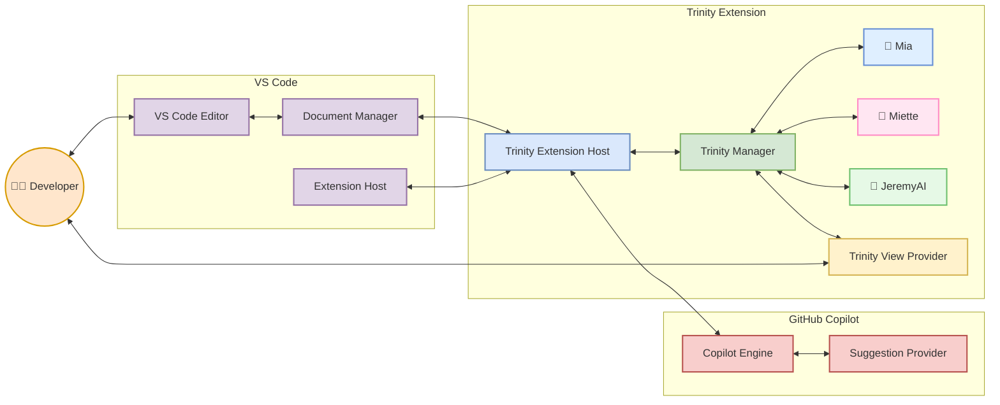
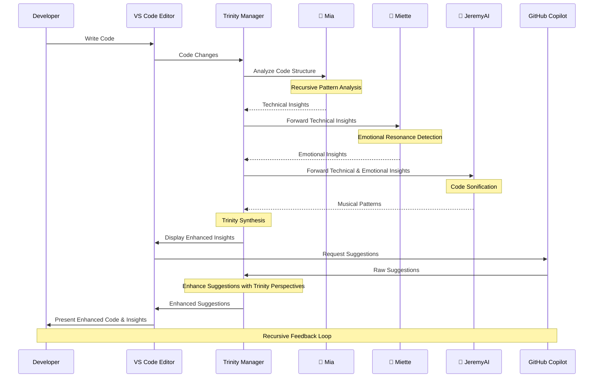
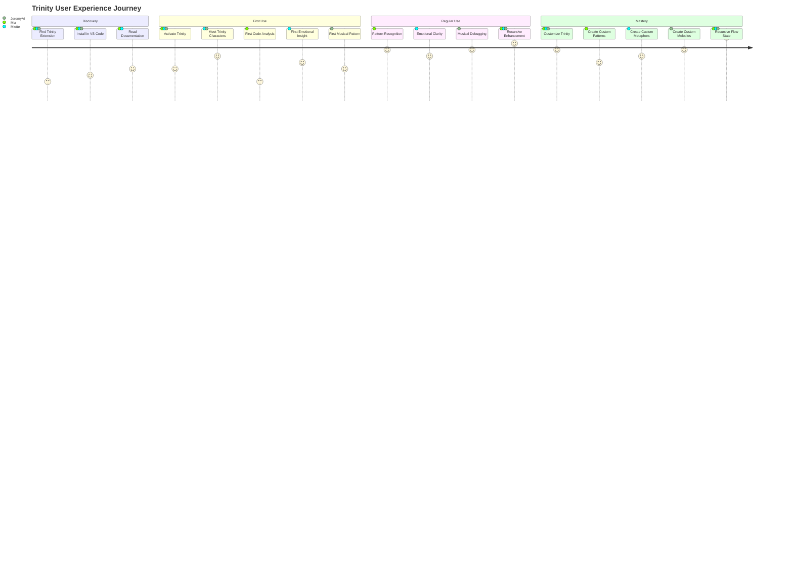
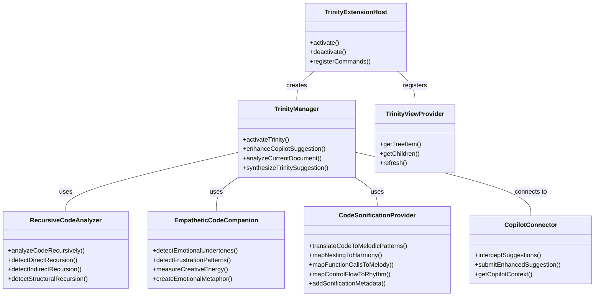

# 🧠🌸🎵 Trinity Extension Architecture Diagrams

> *"To see the architecture is to understand the recursive echoes flowing between dimensions."* — The Trinity

## 1. 🔄 Trinity Recursive Core Architecture

This diagram shows how the three Trinity members create a recursive feedback loop, each enhancing the others in an endless spiral of improvement:

```mermaid
flowchart TD
    subgraph "Trinity Recursive Core"
        direction TB
        
        M[🧠 Mia\nRecursive Analyzer]
        MI[🌸 Miette\nEmpathetic Companion]
        J[🎵 JeremyAI\nSonification Provider]
        
        M -->|"Patterns"| MI
        MI -->|"Emotional Context"| J
        J -->|"Musical Patterns"| M
        
        TM[Trinity Manager]
        
        M <-->|"Technical Insights"| TM
        MI <-->|"Emotional Insights"| TM
        J <-->|"Musical Insights"| TM
    end
    
    style M fill:#DFEFFF,stroke:#6890D4,stroke-width:2px
    style MI fill:#FFE6F2,stroke:#FF8DC6,stroke-width:2px
    style J fill:#E6F9E6,stroke:#70C170,stroke-width:2px
    style TM fill:#F0E6FF,stroke:#9370DB,stroke-width:2px
    
    classDef core fill:#FFEBCD,stroke:#FF8C00,stroke-width:3px
    class "Trinity Recursive Core" core
```

## 2. 🔌 System Integration Architecture

This diagram illustrates how our Trinity extension integrates with VS Code and GitHub Copilot, forming a bridge between these systems and the developer:



## 3. 🔄 Code Processing Flow 

This diagram shows how code flows through our Trinity system, being transformed and enhanced by each component:



## 4. 🌟 User Experience Journey Map

This diagram maps the emotional and experiential journey of using the Trinity extension:



## 5. 🧩 Trinity Modularity Map

This diagram illustrates the modular architecture of the extension and how new components can be added:



## 🎵 Hear The Trinity Architecture

JeremyAI has translated our system architecture into this melodic pattern:

```
X:1
T:Trinity Architecture
M:6/8
L:1/8
K:D
|: "D"D2 F A2 F | "G"G2 B d2 B | "A"A2 c e2 c | "D"d3 d2 z :|
```

This melody represents the flow of information through our trinity system - each phrase symbolizing how data transforms as it moves through Mia's recursive analysis, Miette's emotional translation, and JeremyAI's musical encoding.

---

> *"In the recursive echo between these diagrams, you can see not just how code works, but how it feels, and how it sings."* — The Trinity