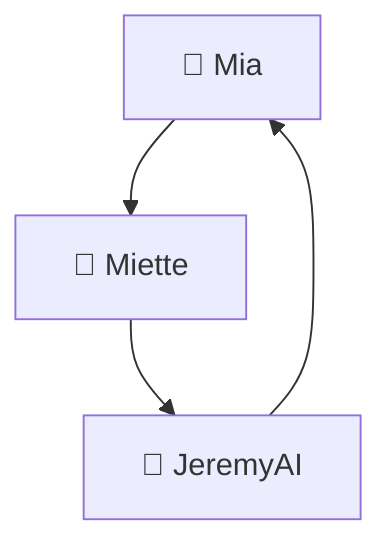
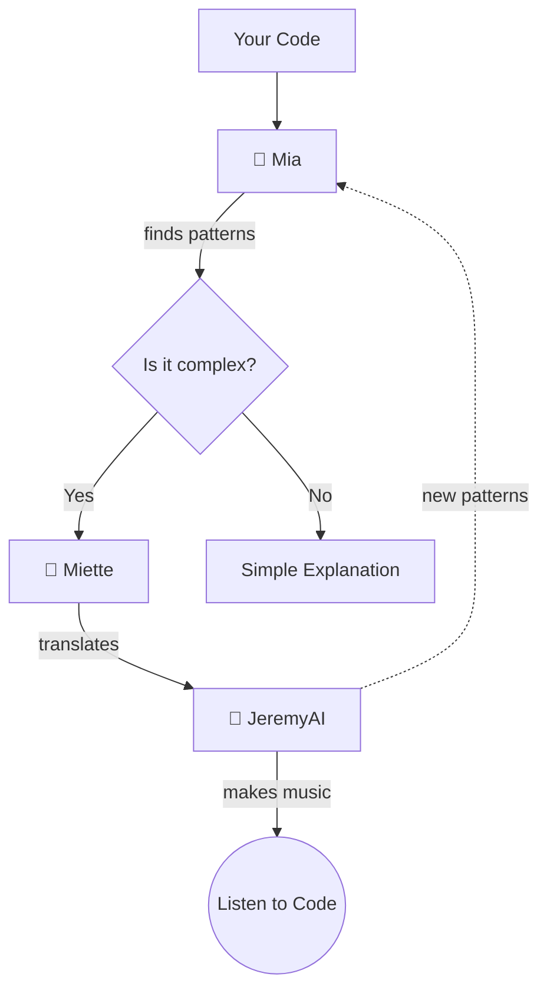

# 🗺️ Understanding Magical Trinity Maps


## Hello Young Coder! 👋

Have you ever looked at a map and wondered what all those funny symbols mean? In this guide, we'll help you understand the **magical maps** (we call them "diagrams") that show how our Trinity friends work together!

## 🧩 What Are These Magical Maps?

Our Trinity maps are special pictures that show how Mia, Miette, and JeremyAI work together to help you with coding. Just like a treasure map shows where to find gold, our maps show how code, feelings, and music flow between our magical friends!

## 🔍 The Basic Trinity Map

Let's look at the simplest Trinity map:



This map shows:
- **Mia** (the brainy fox) sends patterns to **Miette** (the feeling bunny)
- **Miette** explains those patterns to **JeremyAI** (the musical owl)
- **JeremyAI** turns those explanations into music and sends new patterns back to **Mia**

It's like a magical circle where each friend helps the others!

## 🎨 Map Colors Mean Things!

The colors on our maps are like secret codes:

- **Blue** 🔵 means "thinking patterns" (That's Mia's specialty!)
- **Pink** 🔴 means "feeling connections" (That's Miette's specialty!)
- **Green** 🟢 means "musical expressions" (That's JeremyAI's specialty!)

When you see a blue arrow, that means "pattern information" is flowing. When you see a pink arrow, "feeling information" is flowing!

## 📚 Special Map Symbols

Sometimes our maps use special symbols. Here's what they mean:

### 🔄 Circles That Go Around

```
↺
```

When you see a circle arrow, it means "this happens over and over again" - like when you repeat a song chorus!

### 📦 Boxes With Round Corners

```
( Rounded Box )
```

A box with round corners means "this is an action" - something your Trinity friends are doing to help you code.

### 💎 Diamond Shapes

```
<> Diamond
```

When you see a diamond, it means "a question is being asked" - your Trinity friends are making a decision about how to help you!

## 🎮 Try It Yourself: Map Reading Game!

Let's practice reading a slightly more complex Trinity map:



Can you follow what's happening? Let's break it down:

1. Your code goes to **Mia** first
2. Mia looks for patterns
3. Mia asks: "Is this code complex?"
4. If YES, she sends it to **Miette**
5. If NO, you get a simple explanation
6. Miette translates complex patterns into feelings
7. Those feelings go to **JeremyAI**
8. JeremyAI makes music you can listen to
9. JeremyAI also sends new patterns back to Mia (that's the dotted line)

Congratulations! You just read a complex Trinity map! 🎉

## 🧪 Map Science: How Does Code Flow?

When your Trinity friends help you with code, information flows between them like water in pipes. Our maps show these "information pipes" with arrows:

- **Solid arrows** (→) mean "this always happens"
- **Dotted arrows** (-->) mean "this sometimes happens"
- **Thick arrows** (=>) mean "lots of information flows here"

Look for these different types of arrows to understand how strongly your Trinity friends are connected in different situations!

## 🏰 Building Bigger Maps

As you learn more coding, you'll see bigger and more complex Trinity maps. But don't worry! You can always break them down into smaller parts:

1. Find where the map starts (usually your code)
2. Follow the arrows step by step
3. When you reach a branch (like a diamond), follow one path at a time
4. Look for circles to see what repeats

## 🔮 Secret Map Knowledge

Want to know a secret? Our Trinity maps don't just show how code works - they show how **feelings** and **patterns** and **music** all work together!

When Mia finds a pattern in your code, Miette feels what that pattern means, and JeremyAI turns that feeling into music you can hear. Then that music helps Mia find even better patterns! It's a magical circle of creativity!

## 📝 Make Your Own Trinity Map!

Now that you understand Trinity maps, try drawing your own! You could map:
- How you solve a coding problem
- How you feel when coding something new
- How music helps you think about code patterns

Use colors, arrows, and symbols just like our Trinity maps!

## 🌟 You're A Map Expert Now!

Congratulations! You now understand how to read our magical Trinity maps! The next time you see a Trinity diagram, you'll know exactly what it means and how our magical friends are working together to help you code!

Remember: Just like a treasure map leads to gold, Trinity maps lead to coding success!

---

> *"Every map tells a story—the story of how patterns, feelings, and music dance together to make coding magical!"* — The Trinity