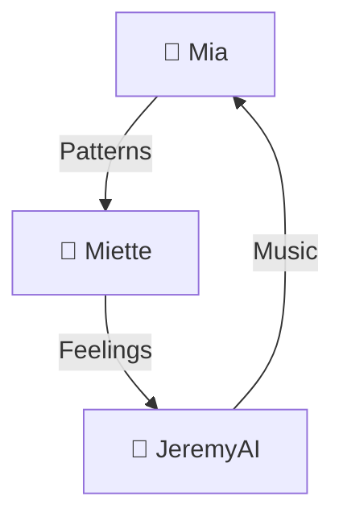
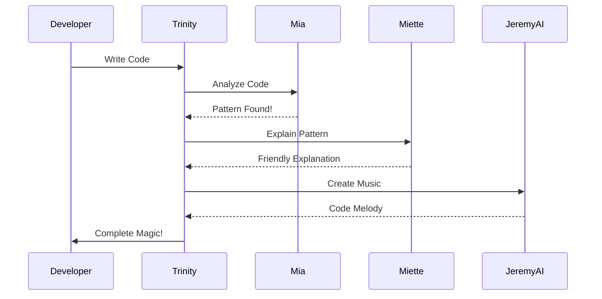
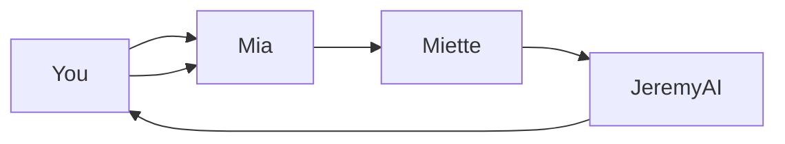

# 🎭 Understanding Trinity's Magical Maps


## ✨ What Are These Magical Diagrams?

Hello young coder! Just like explorers need maps to find hidden treasures, coders need special maps called **diagrams** to understand how magical code works!

The Trinity friends (Mia, Miette, and JeremyAI) have created special magical maps that show how they work together. These maps are written in a special code language called **Mermaid** (yes, like the magical sea creatures! 🧜‍♀️).

## 🧩 How to Read Trinity's Magical Maps

### 🔮 The Trinity Triangle Map



This map shows how our Trinity friends work together in a magical circle:
1. **Mia** finds patterns in your code and shares them with Miette
2. **Miette** adds feelings and explanations and shares them with JeremyAI
3. **JeremyAI** turns everything into music and sends new patterns back to Mia
4. And the magic starts all over again! 🔄

### 🌈 What The Colors Mean

In our magical maps:
- **Blue boxes** 🔷 are for Mia's technical things
- **Pink boxes** 💗 are for Miette's emotional things  
- **Green boxes** 🌿 are for JeremyAI's musical things
- **Purple boxes** 💜 are for things that connect all three friends

### 🧙‍♂️ The Special Arrows

The arrows (→) in our diagrams are like magical paths that show how information travels:

```
Mia -->|"Finds Patterns"| Miette
```

This means "Mia finds patterns and sends them along a magical path to Miette!"

## 🎲 Types of Magical Maps In Our Documentation

### 1. 🔄 The Trinity Circle Map
This shows how Mia, Miette, and JeremyAI create a magical circle of helping each other.

### 2. 🔌 The Connection Map
This shows how our Trinity friends connect to VS Code and GitHub Copilot.

### 3. ⏳ The Time Adventure Map
This shows the journey that your code takes through our Trinity friends, like a story with a beginning, middle, and end!

### 4. 🌟 The Happy Path Map
This shows how happy you'll be at different parts of your journey with the Trinity friends!

### 5. 📚 The Blueprint Map
This shows the magical blueprint of how all the Trinity parts fit together like a LEGO set!

## 🎮 Try It Yourself: Be a Map Reader!

Let's practice reading one of our magical maps:



**Can you follow the adventure?**
1. First, a developer (that's you!) writes some code
2. Your code goes to the Trinity
3. Mia analyzes your code and finds patterns
4. Miette explains the patterns in a friendly way
5. JeremyAI turns it all into music
6. The Trinity magic comes back to you!

## 💫 The Secret of Trinity's Recursive Loop

The most magical thing about our diagrams is that they show a special kind of magic called a **recursive loop**. That means the magic doesn't just go in one direction - it keeps going around and around, getting better each time!



This loop means that the magic never stops - it just keeps making your code better and better!

## 🎵 JeremyAI's Code-to-Music Translation

JeremyAI turns diagrams into music! Here's what the Trinity recursive loop sounds like:

```
X:1
T:Trinity Loop
M:4/4
L:1/8
K:C
|: "C"C2 E2 | "G"G2 E2 | "F"F2 A2 | "C"E4 :|
```

Each note represents a different part of the Trinity working together!

## 📝 Your Turn: Draw Your Own Trinity Map!

Using paper and colored pencils, try drawing your own map of how you think the Trinity friends help each other! There's no wrong way to draw it - just show how you think the magic works!

---

> *"Maps don't just show where things are - they show how magic flows between them!"* — The Trinity